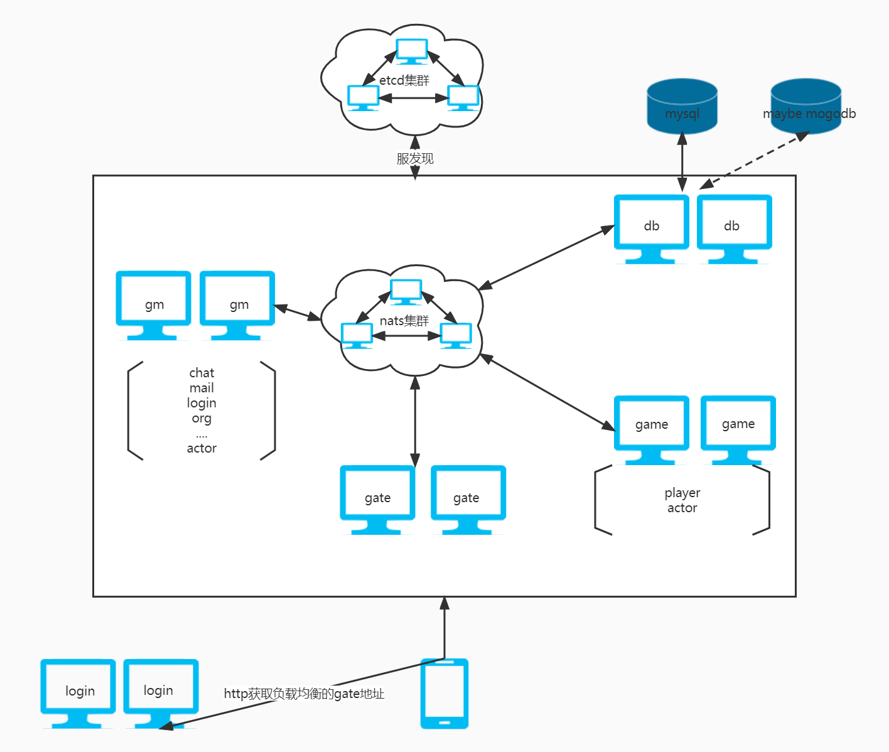

# go-actor

**这是一款分布式的golang游戏服务器框架 基于golang + actor model技术构建 它具备高性能、可伸缩、分布式、协程分组管理等特点。并且上手简单、易学**


框架示意图：



## **快速开始**

新建一个非网关服务

```
func main() {
	var cfg string
	var nodeId int
	flag.StringVar(&cfg, "config", "config.yaml", "游戏配置文件")
	flag.IntVar(&nodeId, "id", 1, "服务ID")
	flag.Parse()

	// 加载游戏配置
	yamlcfg, node, err := yaml.LoadConfig(cfg, pb.NodeType_NodeTypeRoom, int32(nodeId))
	if err != nil {
		panic(fmt.Sprintf("游戏配置加载失败: %v", err))
	}
	nodeCfg := yamlcfg.Room[node.Id]

	// 初始化日志库
	if err := mlog.Init(yamlcfg.Common.Env, nodeCfg.LogLevel, nodeCfg.LogFile); err != nil {
		panic(fmt.Sprintf("日志库初始化失败: %v", err))
	}
	async.Init(mlog.Errorf)

	// 初始化游戏配置
	mlog.Infof("初始化游戏配置")
	if err := config.Init(yamlcfg.Etcd, yamlcfg.Common); err != nil {
		panic(err)
	}

	// 初始化redis
	mlog.Infof("初始化redis配置")
	if err := dao.InitRedis(yamlcfg.Redis); err != nil {
		panic(fmt.Sprintf("redis初始化失败: %v", err))
	}

	// 初始化框架
	mlog.Infof("启动框架服务: %v", node)
	if err := framework.InitDefault(node, nodeCfg, yamlcfg); err != nil {
		panic(fmt.Sprintf("框架初始化失败: %v", err))
	}

	// 功能模块初始化 todo
	if err := manager.Init(); err != nil {
		panic(fmt.Sprintf("功能模块初始化失败: %v", err))
	}

	// 服务退出
	signal.SignalNotify(func() {
		manager.Close()
		framework.Close()
		mlog.Close()
	})
}
```

服务间同步通讯

```
dst := framework.NewGameRouter(playerId, "Player", "ConsumeReq")
newHead := framework.NewHead(dst, pb.RouterType_RouterTypeUid, playerId)
rsp := &pb.ConsumeRsp{}
if err := framework.Request(newHead, req, rsp); err != nil {
	mlog.Infof("Request Error: %v", err)
}
```

服务间异步通讯

```
newHead := framework.NewHead(dst, pb.RouterType_RouterTypeUid, playerId)
framework.Send(newHead , req)
```

同服务异步通讯

```
act.SendMsg(head, req, rsp)
```
